# Qubes Global Config

This is a tool for editing all sorts of global configuration settings of 
Qubes OS. It provides a user-friendly way to access system settings without
manually editing policy files or using CLI commands.

### Usage

Most settings can be changed simply by clicking on them; in policy rules,
you can click on any rule to edit it, or remove it with the `x` button
on the right (if possible: you cannot remove default rules).

Some settings - in particular those that should not be changed 
accidentally - require you to first click on the settings icon next to the setting to 
change it. 

Some changes require confirming with `save` button. If you do not confirm changes,
they may be discarded when switching tabs of the settings window.

## General settings

The General Settings tab contains some settings contained in old
`qubes-global-settings`, such as Clock qube, default qubes (default net qube, 
default template, default disposable template); X Desktop settings (such
as allowing fullscreen or tray icon style); memory balancing settings
and default linux kernel.

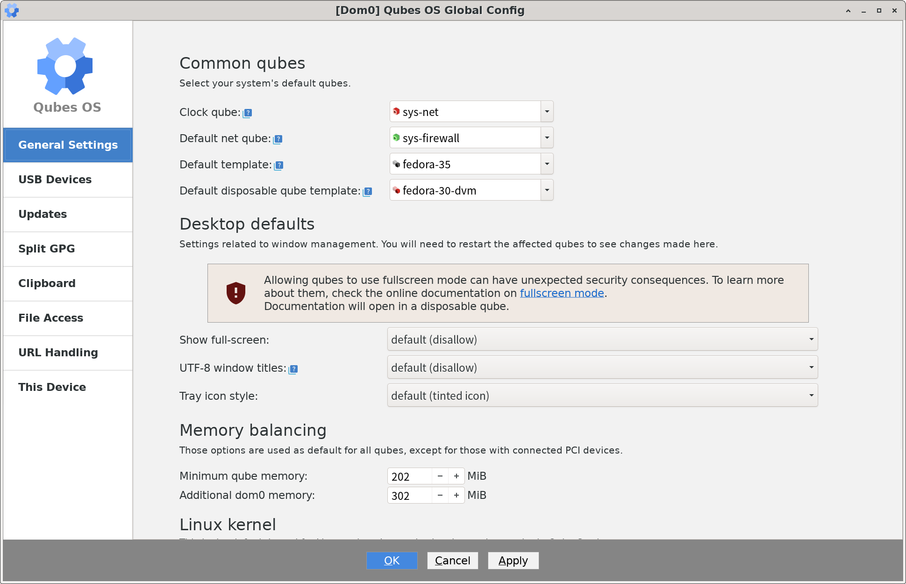

### Common qubes

*Clock qube* is the qube used to sync qube clocks after various operations;
if the user selects None or a non-networked qube, the clocks in various
qubes may behave unpredictably.

*Default net qube* is used as netqube by all qubes who have *Networking*
set to default. It's also the default setting for newly created qubes.
Per-qube setting can be changed in the qube's Settings.

*Default template* is used as template for all newly created qubes. Unlike 
other options in this section, changing default template does not influence
existing qubes.

*Default disposable qube template* is used by default as template for 
disposable qubes launched from all qubes. Per-qube setting can be changed 
in the qube's Settings.

### Desktop defaults

All settings from this section will only work after restarting affected 
qubes.

*Show full screen* setting enables application from qubes to become fullscreen. 
By default, this is disabled, as it can lead to security issues.

*UTF-8 window titles* enabled using the full power of Unicode in window titles.
By default, Qubes OS converts all window titles to ASCII and replaces all
non-ASCII characters (such as diactricts, non-latin alphabet characters 
or emojis) with underscores. This is due to security implications of parsing
Unicode. If you are sure you know what you're doing, you can enable showing
all unicode characters in window titles.

*Tray icon style* affects the way icons in the tray area (such as Network
Manager icon) are colored. The default option is tinting them with the color
of their qube, to keep it clear which qube a given tray icon comes from.

### Memory balancing

The settings in this section are used for all qubes, except for 
those with connected PCI devices and those with dynamic memory balancing
disabled.

*Minimum qube memory* is the amount of memory every qube always receives,
regardless of its own settings.

*Additional dom0 memory* allows you to allocate more memory to dom0 permanenty.

### Linux kernel

This is the default kernel used by all Linux qubes. It can be changed per-qube
in Qube Settings.

## USB Devices

Settings in this tab apply to various devices connected as USB. The USB qube
is a name for the qube to which the USB controller(s) are connected to. As
there is no straightforward property in the Qubes OS called "USB qube", it can 
happen that you changed device assignation, but there is no way for
Global Config to know about this change. Thus, you can select a qube at 
the top to which your USB controller(s) is connected. 

This should only be changed if you manually changed device assignation before -
in itself, the _USB qube_ setting is just a convenience setting for various
policies in this Global Config tab.

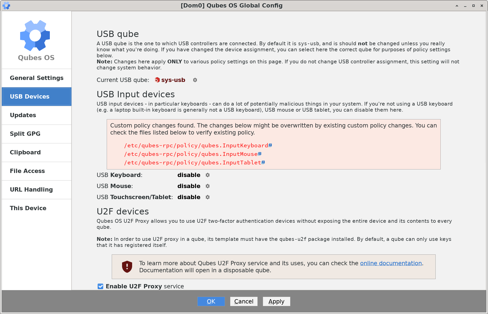

### USB Input devices

USB Input devices are potentially very powerful and dangerous to your system -
if a USB devices maliciously claims to be e.g. a keyboard, it can cause
significant security issues. Thus, by default USB input devices (keyboard,
mouse, all sorts of touchscreen devices) are not connected in Qubes. If you
are using a USB input device, here you can enable it. 

If you select *ask* as policy for a given USB device, you will be asked 
each time you connect the device if it should be enabled.

USB input devices cannot be enabled per-qube or connected effectively just to
one qube, they are always enabled for general system input. 

### U2F Devices

If you are using U2F security tokens, you can configure them in this section.
U2F support in Qubes relies on a package called `qubes-u2f`, which must
be installed in the template of the qube that uses U2F devices (or in 
the qube itself, if it's a standalone qube). Qubes U2F support by default
allows a qube with u2f enabled to only use keys that it has itself
generated on the device. If you do not enable registering new keys for
a given qube, it will only be able to use keys it has registered previously
using Qubes U2F support. 

You can also enable blanket access to a given qube - then, it can access
all keys stored on the device, regardless of whether it has created them or
they were created by other qubes or on other systems. This is the only way
to access keys created on other systems with Qubes U2F tools, but as the 
security risks are significant, this option should be used cautiously.

## Updates

Some settings in this tab are the same as in old `qubes-global-settings`,
but provide more flexibility.

### dom0 updates

The *dom0 Update proxy* is the qube through which updates are downloaded
for dom0. It must be a networked qube, if you want updates to happen.

Below that, you can select type of updates enabled in dom0: *stable* updates
are the well-tested updates with least amount of bugs, while *testing* updates
have been only recently developed and might contain bugs. If you want, you
can enable only *security-related* testing updates, which allow for a balance
of safety and avoiding bugs.

### Check for qube updates

By default, every qube that has network access checks for updates; if it has
a template, it checks for updates for this templates, and if not, for itself.

You can disable or enable this per-qube, but remember that every new
qube has this checking-for-updates behavior enabled. Even if you select 
*Disable checking for updates for all qubes* in this window, it will only apply
to qubes that exist when you click *OK* - you will need to re-enter this screen
and apply settings if you create a new qube.

*dom0* checks for updates using the selected above *dom0 Update Proxy*.

### Update Proxy

Update Proxy is qube used for updating qubes without Internet access, such
as templates, without exposing them to the whole of the Internet. You
can select a default update proxy for all normal qubes and one for all Whonix 
qubes (if Whonix is installed in your system) - Whonix Update Proxy must 
be a Whonix qube, though. If you would try to select a non-Whonix qube
as an Update Proxy for Whonix qubes, you would not be able to update them.

You can also select update proxies for each qube specifically to override the 
default above. Only qubes without internet access can have an Update Proxy.

### Template repositories

New templates in Qubes can be installed using Qubes Template Manager
or via commandline `qvm-template` tool. Here you can select which template
repositories should be used by those tools.

*Official Qubes OS templates* are always enabled - they are the well-tested,
official templates. You can also enable *testing* repositories for official
templates - those allow you to get new templates a bit earlier, but there
is an increased risk of bugs.

*Community templates* are those not maintained by the Qubes OS team, but 
by the general community. They also have a *testing* repository option.

## Split GPG

Split GPG allows you to keep your GPG keys in a selected, secure qube
(it's a good idea to choose for this a qube that's not connected to
the Internet). To use this, install `qubes-gpg` and set up you access
qube(s) and permissions in this window.

Every qube you want to keep your keys in has to be added to the top list
of *Access qubes*. By default, all other qubes can attempt to access 
keys from selected access qubes (you will be prompted for confirmation
every time). If you select that all qubes *cannot* access keys from a given 
key qube, you have to add exceptions below to actually use the key qube.

In the exception list below, you can select for a given qube the option to
*automatically* always access and be allowed access to keys from a given
key qube, to be able to *ask* for keys from a given key qube (and show you
a RPC confirmation window at each attempt), or to *never* be able to access 
keys from a given key qube.

## Clipboard

Here you can change various clipboard settings. Qubes OS protects you from
various clipboard data attacks by not exposing clipboard from each qube to
every other qube - you have to consciously copy things from one qubes's clipboard 
to the global clipboard, and then paste them into desired target qube.

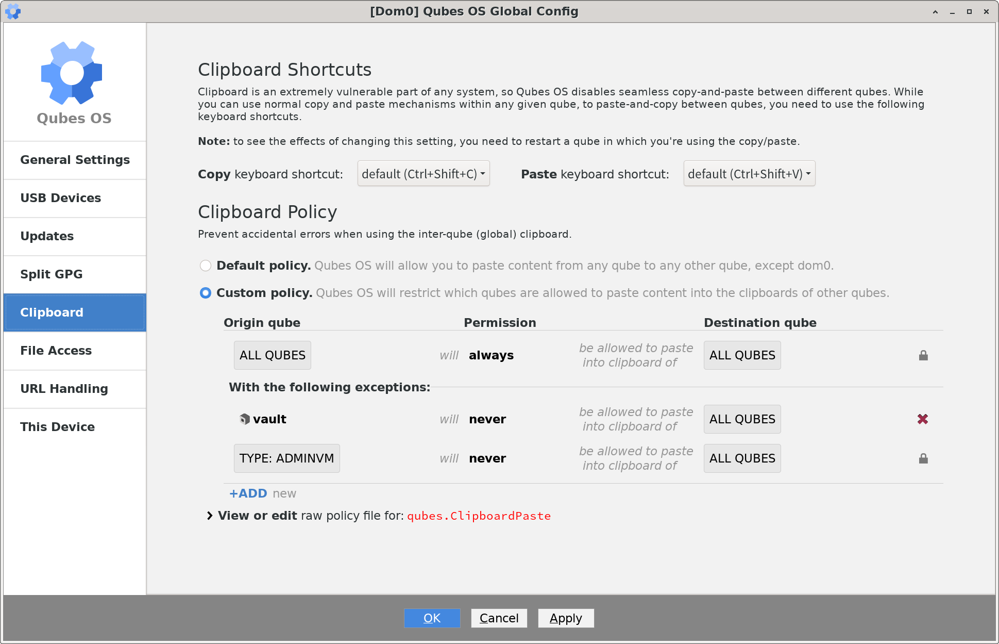

### Clipboard shortcuts

You can customize the clipboard shortcuts used for copy and paste to the
global clipboard here. In order to see the changes, you need to restart
the qubes you are copying from.

### Clipboard policy

By default, all qubes except for AdminVM/dom0 can copy and paste into all other qubes
(except for AdminVM/dom0).
Here you can select exceptions, for example disable all copying from select
qubes or copy/paste between certain qube combinations.

You cannot enable copying and pasting to/from Admin VM. Use the Qubes
Clipboard widget if you need to perform a copy/paste operation involving the
AdminVM.

## File Access

Various policies regarding inter-qube file access can be found here.

### Moving and copying files

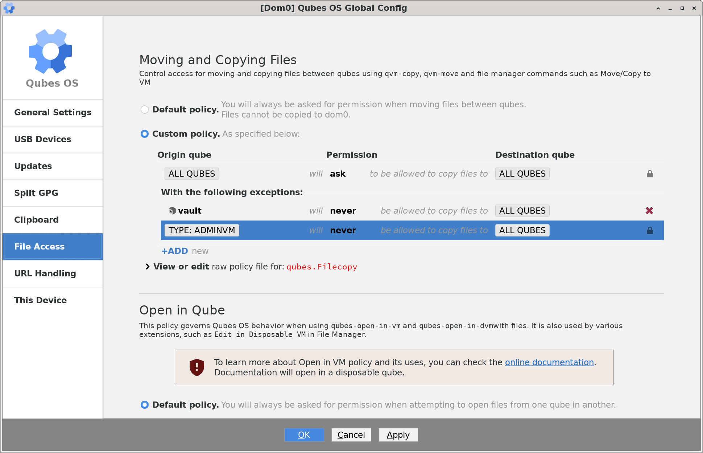

Files can be copied and moved across qubes using both file manager menus
(options such as `Copy to Qubes VM`) and command line tools (`qvm-copy`,
`qvm-move`, `qvm-copy-to-vm` and `qvm-move-to-vm`). By default, you will
always be asked for permission when copying/moving files.

You can change the default to always *allow* copying (then you need to use
`qvm-copy-to-vm` and `qvm-move-to-vm` to select qube to copy to when
copying) or to *never* allow it.

You can also disable certain combinations (e.g. always forbid copying/moving
files from a certain qube to ensure files within it will not leak out by
accident or misclick), or allow them (if the default is never to allow
copying/pasting).

### Open in qube

The settings contained here govern what happens when you're using options such
as `Open in Disposable VM`.

By default, every qube can open files in its own (that is, based on its
own Disposable Qube Template) disposable qubes, and if you attempt to open files
in another, normal qube, you will always be asked for permission.

You can change the settings here, adding and removing any desired exceptions.

## URL handling

This policy governs Qubes behavior when using `qubes-open-in-vm` with URLs.
If you set up a given qube to open all links using `qubes-open-in-vm`
(as described in documentation linked on this page), you can use this tab
to set up appropriate policy rules.

## This device

Here you can see general information about your device. They
can be useful for debugging or just for verifying information such as "how 
much RAM exactly do I have".

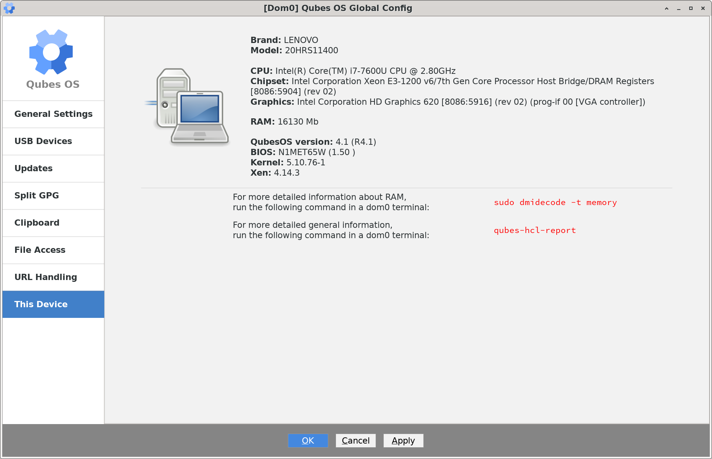

## Editing raw policy files

In some places, you can edit raw policy files. The settings program will
attempt to translate your edits into graphically editable rules, although
not all possible combinations may be supported. However, if you
want to use rules such as "for all qubes with a certain tag do X", you
can use the raw edit window to replace origin /target qubes generated by the
program (such as `@anyvm` or `work`) with more complex strings,
such as `tag:whonix`.

## Manual editing of policy files

You can also edit policy files manually in `dom0`; files used by the configuration
tool are prefixed with `50-config` and should not be changed. If you want
to have your own changes take precedence over settings from the tool, you
can add your own files; as long as they come before `50-config` in alphabetical 
order, they will be parsed first.

# New Qube

A simple tool to create a new and set it up. Provides more information and
more options than the existing tool.

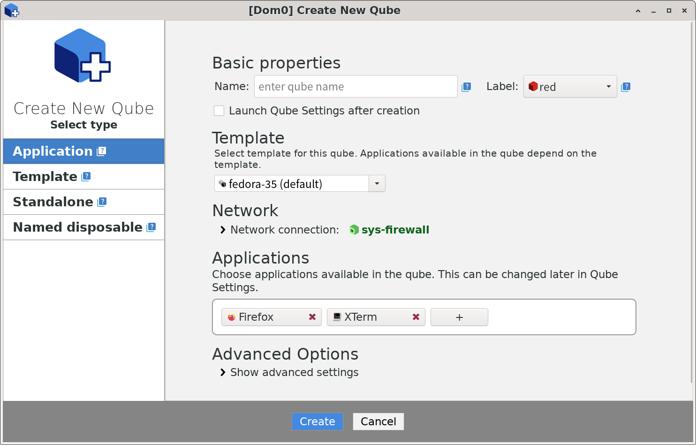

The qube label influences tinting of this qube's icons in the window manager,
and - first and foremost - determines the color of window decorations (
border and title bar) to allow you to easily check which qube you're currently
working with.

You can selected any available template for new Application qubes (if you
want to create a standalone qube, you can select the type on the left).

New templates can be installed from command line (using `qvm-template`) or
using Qubes Template Manager.

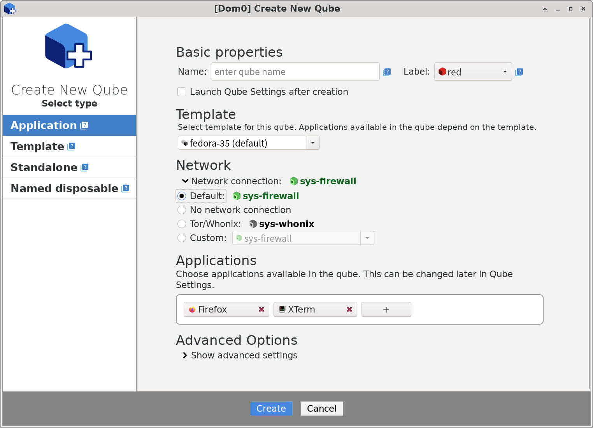

Network settings can be expanded simply by clicking on them; you can choose
to use default networking qube (which is set in `Qubes Global Config`) or
select a different qube or no network at all. If you have Whonix installed
in your system, you can also select the Whonix qube.

### Applications

For qubes based on templates (or cloned from existing qubes) you can
also select applications that will be listed in the newly created
qube's menu; this can also be changed later from Qube Settings.

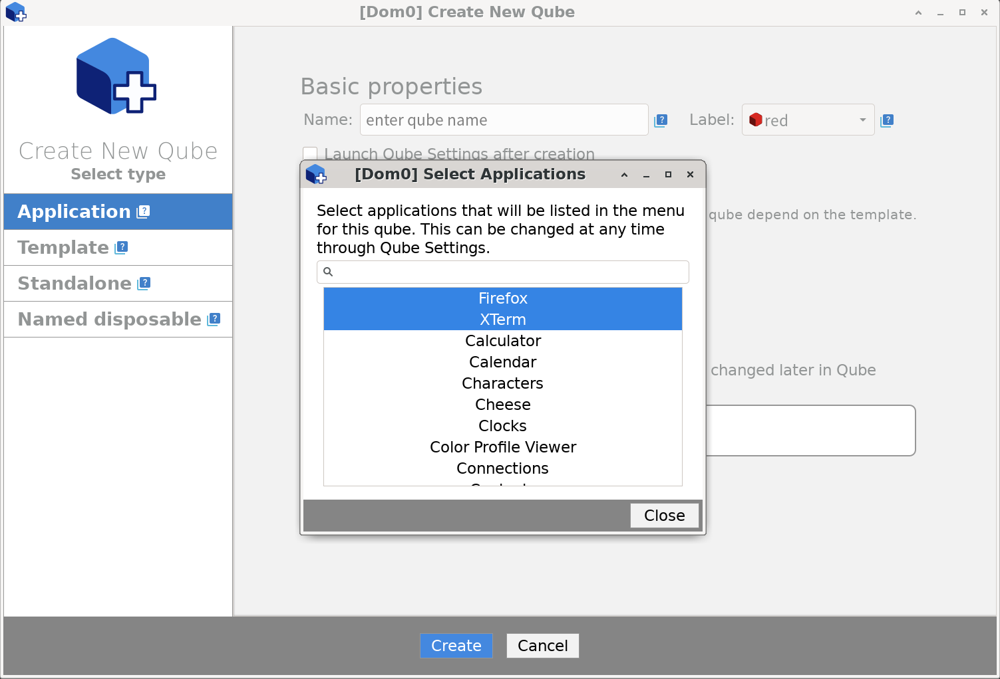

If you search for an application that's not available in the current template,
but exists in another templates, you can select them from here
and switch your new qube to the other template.

### Advanced settings

Advanced settings should only be changed by users who know why they are changing
them.

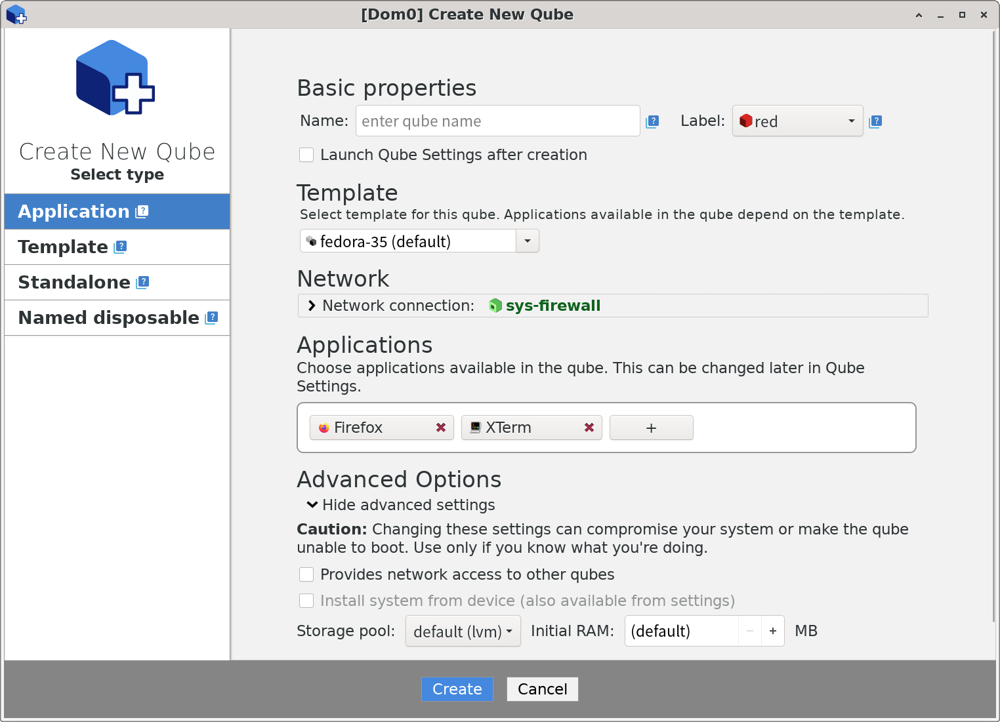

Allowing *network access* through the newly-created qube means it can be used
as a net qube for other qubes.

*Installing system from device* is available only for qubes not based on
a template and not cloned from an existing qube (that is, template and
standalone qubes).

If you have multiple storage pools configured in your system, you can select
the *storage pool* to use here, as well as the amount of RAM the qube will
get at start (*Initial RAM*).

### New template

You can also use this window to create new template qubes, which can
be cloned from existing templates (useful if you want to customize
the template to a high degree, for example by having a template with
very few installed applications) or empty.

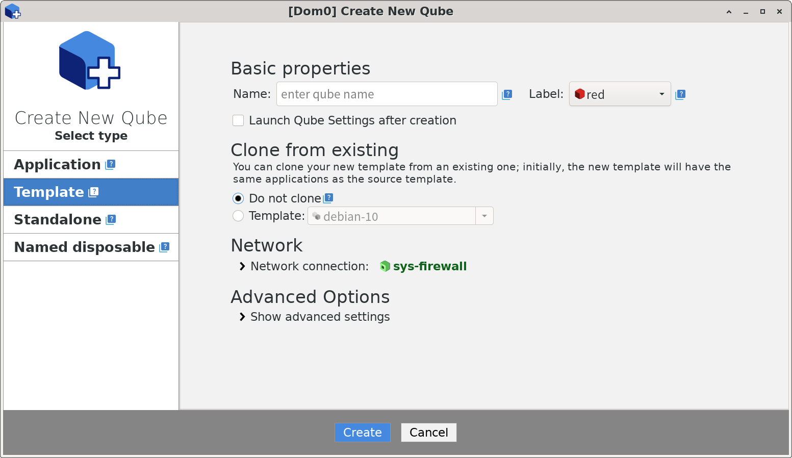

If you want to create a new template based on an existing Linux distribution,
do not use this tool - this is handled by `Qubes Template Manager` or the
command line `qvm-template` tool. 

### New standalone qube

A new standalone qube can be cloned from an existing qube, or empty (if empty,
you can for example install a system to it from device).

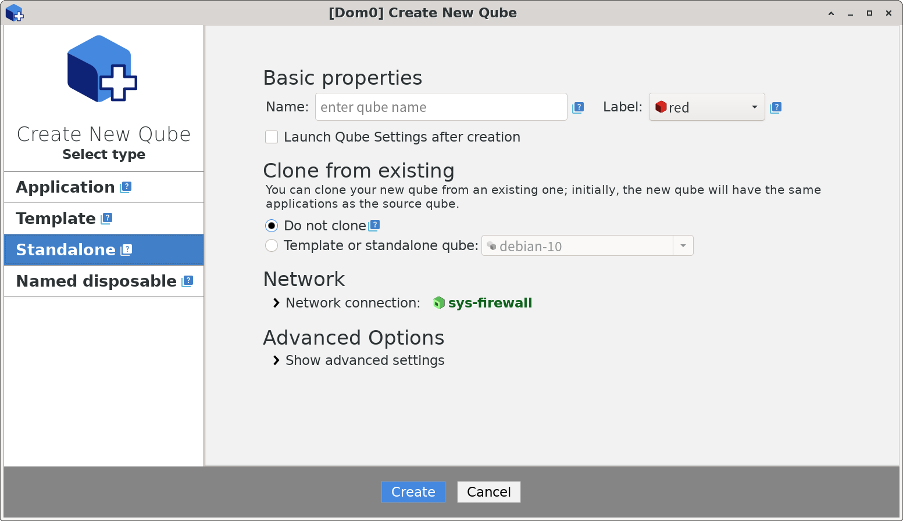

### New named disposable qube

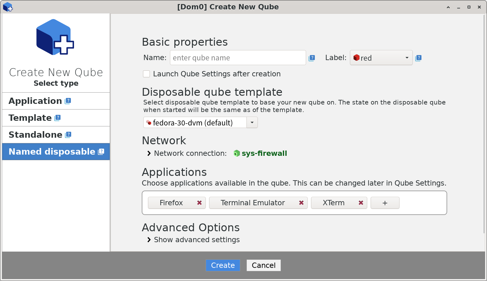

A named disposable qube behaves like a normal disposable qube (that is,
does not store any information between reboots), but has a set name
and settings. It can be used as, for example, a net qube by other qubes.

